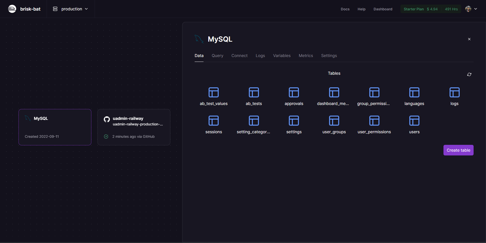

# Golang and [uAdmin](https://github.com/uadmin/uadmin) CI/CD using [🚅Railway](https://railway.app/)!

[](https://railway.app/new/template/9IP5nJ?referralCode=A7siyP)

## Steps to Deploy
- Make sure to create a Github account and link it with [🚅Railway](https://railway.app/)
- Click [](https://railway.app/new/template/9IP5nJ?referralCode=A7siyP)

   

- Give your new Repository a name (and select the visibility if you want to make it private)
- Set the Environment Variables to the following (you can change the port as per your needs):

|                               Value                               | env variable   |
| :---------------------------------------------------------------: | -------------- |
| `1`                                                               |`CGO_ENABLED`   |
| `8080`                                                            |`PORT`          |
| `gcc`                                                             |`NIXPACKS_PKGS` |
| `encryption key used for encrypting and decrypting the  database` |`KEY`           |
| `salt used for encrypting and decrypting the database`            |`SALT`          |

- and finally click on `Deploy`

## TA-DA! 🎉 Your app is deployed!

- A github repository will be created with the name you gave in the previous step
- A uadmin instance is run
- It is hosted on a live URL (which you can find in the `Deployments` tab of your project)
- The expected port is exposed 
- An SSL certificate is generated
- A MySQL database is automatically created and linked to uAdmin
- The database is encrypted using the `KEY` and `SALT` environment variables
  
### All that with a click of a button and a few environment variables!

 
   

Finally, to setup this repository locally, you can follow the steps below:

- Head over to github and clone the repository that was created for you.
- Clicking on MySQL on the railway dashboard will give you the following details:
    
  - The values for the fields like `host`, `port`, `user`, `password` and `name` can be found in the above screenshot from the fields `MYSQLHOST`, `MYSQLPORT`, `MYSQLUSER`, `MYSQLPASSWORD` and `MYSQLDATABSE` respectively.
  
> **host** ⇄ **MYSQLHOST**

> **port** ⇄ **MYSQLPORT**

> **user** ⇄ **MYSQLUSER**

> **password** ⇄ **MYSQLPASSWORD**

> **name** ⇄ **MYSQLDATABSE** 

- Create a `.database` file in the root of the repository and add the following content to it using the values mapped from the previous step:
  
```json
{
  "type": "mysql",
  "name": "railway",
  "user": "root",
  "password": "********************",
  "host": "*********************.railway.app",
  "port": 1234
}
```
- Create a `.encrypt` file in the root of the repository and add the following content to it using `KEY` and `SALT` environment variables from the railway dashboard:
  
```json
{
  "KEY": "*********************",
  "SALT": "*********************"
}
```

> You can test the connection to the MySQL instance by running the following command in the root of the repository locally (assuming you have go installed on your machine):
  > ```shell
  > go mod download; go build .; ./railway
  > ```

Commit these changes to the repository and push them to github.

### Now for the cool part!
Since railway automatically deploys the app whenever there is a change in the repository, you will see that a new build is triggered and the app is deployed with the changes you made as soon as you push them to github!


To fix:

```jsx
[  ERROR ]   Hanlder.NewLogger. Unix syslog delivery error
```

> Update on the above error: The issue is solved in HEAD and will be releases in a new version with the update. (~Internal Sources 👀)

## About me

[](https://github.com/Gaurav-Gosain)

<!-- ## Website Page Speed -->

<!--  -->

## Star History

[](https://star-history.com/#Gaurav-Gosain/uadmin-railway&Date)

<div style="display:flex;flex-wrap:wrap;">
  
  
  
  
  
  
  
  
  
  
<div>

