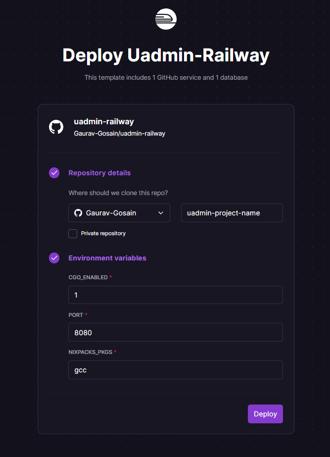
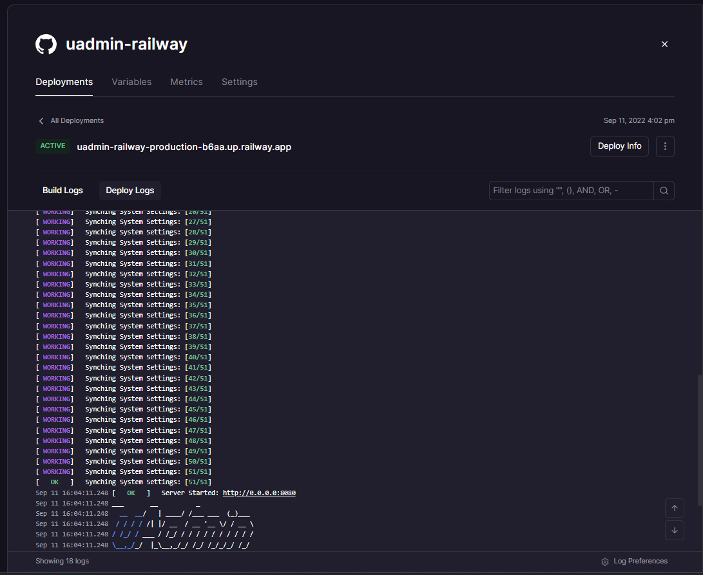
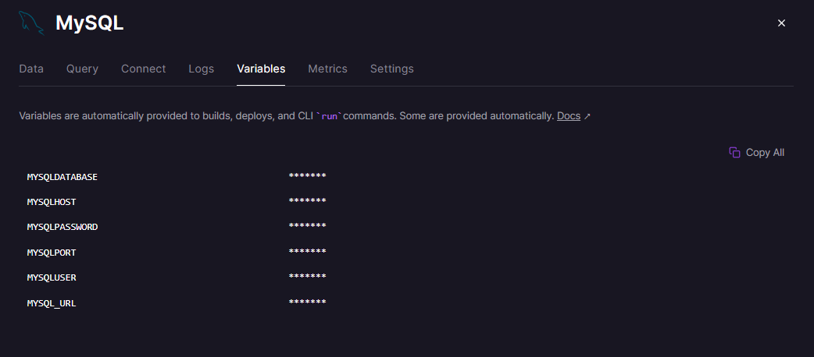

# ⚠️ Work In progress

## This is a Test Repository to test Golang and uAdmin CI/CD using [Railway 🚅](https://railway.app/)!

[](https://railway.app/new/template/B9fy5q?referralCode=A7siyP)

## Steps to Deploy
- Make sure to create a Github account and link it with [Railway 🚅](https://railway.app/)
- Click on [](https://railway.app/new/template/B9fy5q?referralCode=A7siyP)

  

- Give your new Repository a name (and select the visibility if you want to make it private)
- Set the Environment Variables to the following (you can change the port as per your needs):
  - CGO_ENABLED : `1`
  - PORT : `8080`
  - NIXPACKS_PKGS : `gcc`
- and finally click on `Deploy`

## TA-DA! 🎉 Your app is deployed!

  

Now all that's left is to make some changes to the code to instruct uAdmin to use our custom provisioned MySQL instance hosted on Railway instead of using the defauly sqlite database (which will not be persistent) and see the changes reflected in the deployed app!

Steps to do that:

- Head over to github and clone the repository that was created for you.
- Create a `.database` file in the root of the repository and add the following content to it:
  - Clicking on MySQL on the railway dashboard will give you the following details:
      
    - The values for the fields like `host`, `port`, `user`, `password` and `name` can be found in the above screenshot from the fields `MYSQLHOST`, `MYSQLPORT`, `MYSQLUSER`, `MYSQLPASSWORD` and `MYSQLDATABSE` respectively.
  
```json {}[.database]
{
  "type": "mysql",
  "name": "railway",
  "user": "root",
  "password": "********************",
  "host": "*********************.railway.app",
  "port": 0000
}
```

Commit these changes to the repository and push them to github.

### Now for the cool part!
Since railway automatically deploys the app whenever there is a change in the repository, you will see that a new build is triggered and the app is deployed with the changes you made!